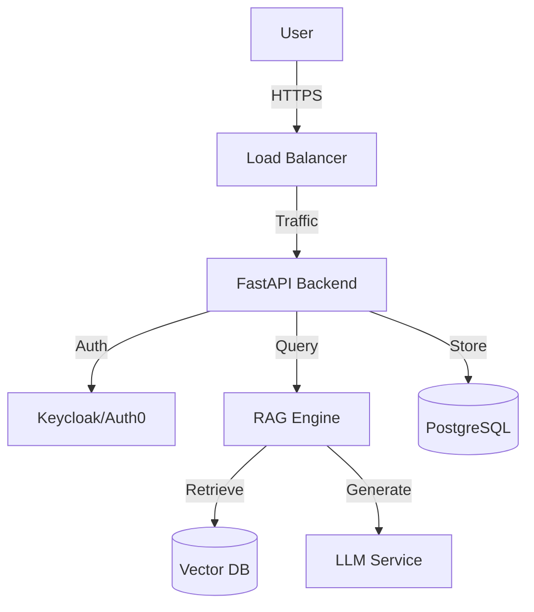

# Enterprise GenAI Platform 🏢

A scalable, secure, and production-ready Conversational AI platform designed for enterprise environments. Built with FastAPI, LangChain, and React.

## 🚀 Features

-   **RAG Pipeline**: Advanced Retrieval-Augmented Generation with vector database integration (Qdrant/Milvus).
-   **Role-Based Access Control (RBAC)**: Secure API endpoints with JWT authentication.
-   **Admin Dashboard**: React-based interface for managing users, documents, and monitoring usage.
-   **LLM Agnostic**: Support for OpenAI, Azure OpenAI, and Anthropic Claude.
-   **Containerized**: Fully Dockerized for easy deployment via Kubernetes.

## 🏗️ Architecture



## 🛠️ Tech Stack

-   **Backend**: Python, FastAPI, LangChain
-   **Frontend**: React, TypeScript, TailwindCSS
-   **Database**: PostgreSQL (Metadata), Qdrant (Vector)
-   **DevOps**: Docker, Kubernetes, GitHub Actions

## 📦 Getting Started

### Prerequisites
-   Docker & Docker Compose
-   Python 3.10+
-   Node.js 18+

### Installation

1.  **Clone the repository**:
    ```bash
    git clone https://github.com/yourusername/Enterprise-GenAI-Platform.git
    ```

2.  **Start Services**:
    ```bash
    docker-compose up -d
    ```

3.  **Access Dashboard**:
    Open `http://localhost:3000`

## 📄 License
MIT License
